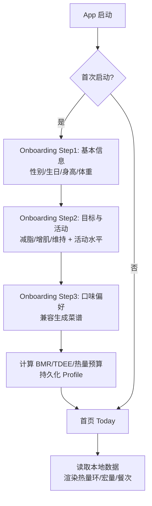
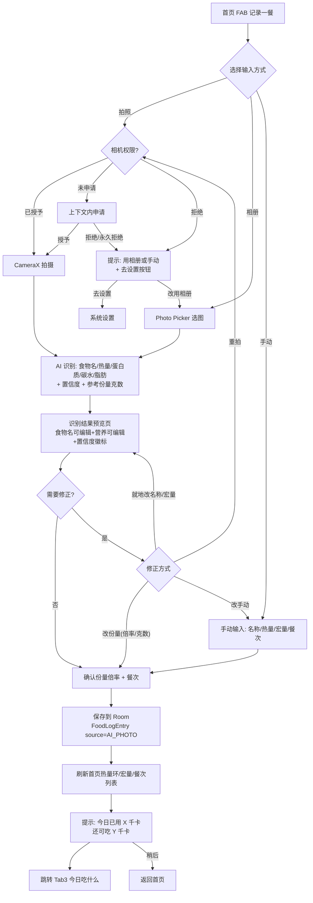
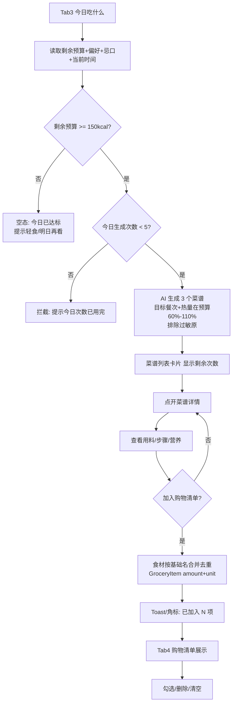
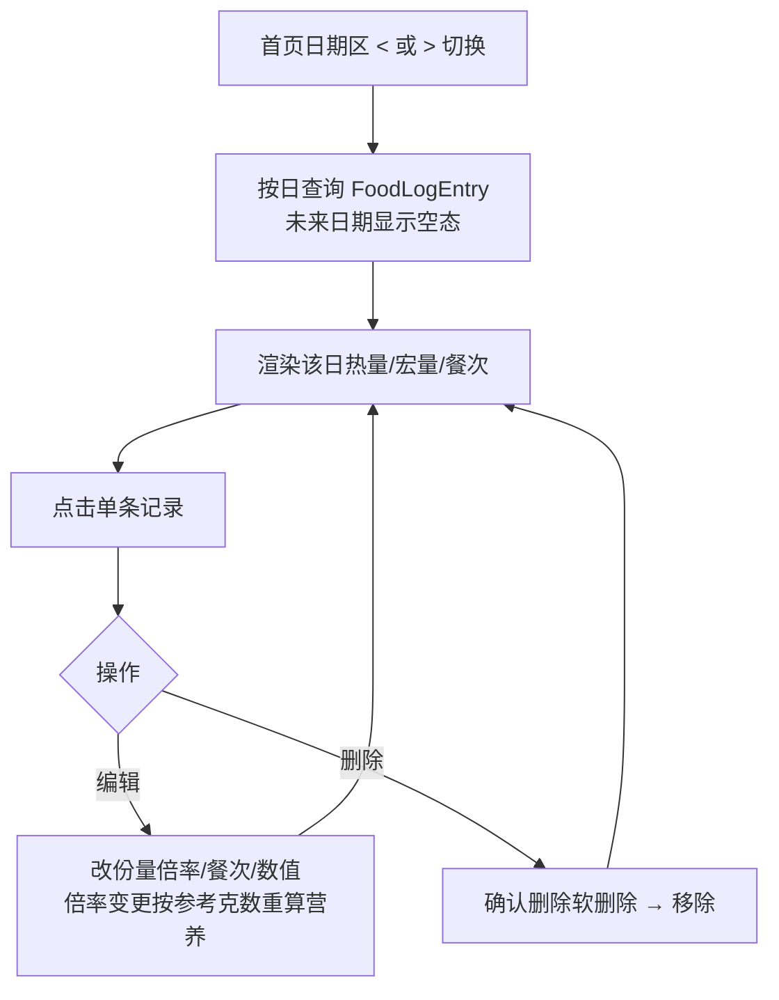
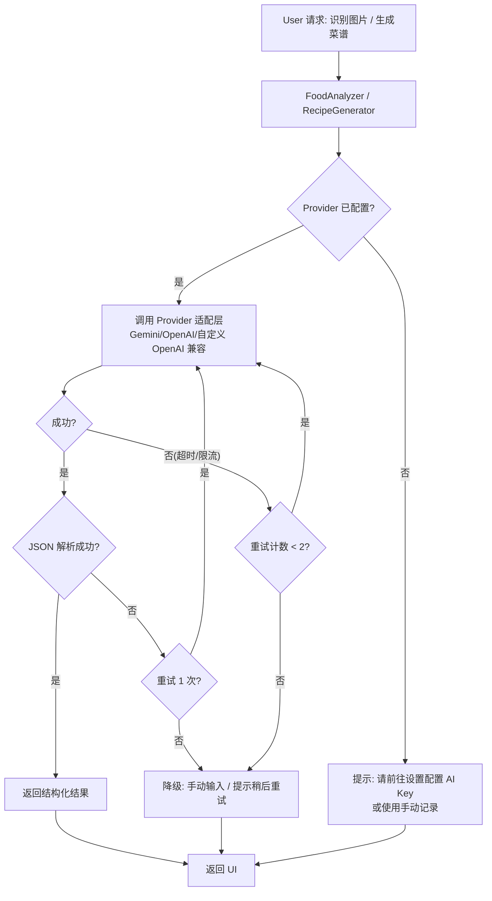
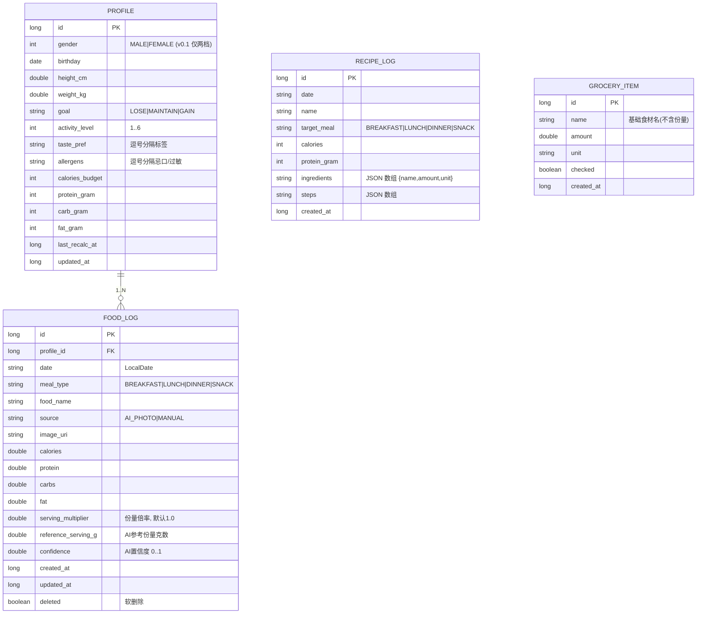

# NutriMate MVP 信息架构与核心页面流程

> 代号：**NutriMate**（暂定，可改）
> 定位：面向减脂/增肌用户的「拍照记录 + 今日吃什么 + 一键购物清单」健康饮食管理 App
> 参考对象：Fitia（功能闭环/食谱/购物清单）、Cal AI（拍照极简）、fud-ai（开源架构/BYOK 多 AI 提供商）
> 版本：v0.1（MVP 范围）

---

## 1. 产品愿景与差异化

- **一句话**：每天 30 秒拍一餐，AI 记录营养；想吃了打开 App 就知道「今天吃什么」，菜谱一键变购物清单。
- **差异化**（vs Fitia / Cal AI / Lifesum）：
  1. **拍照路径极短**（Cal AI 式：拍 → 确认 → 完成，≤3 步）
  2. **「吃什么」是核心回答**（Fitia 式：剩余热量预算 + 偏好 → 菜谱推荐，而非只给列表）
  3. **购物清单一键生成**（Fitia 式：菜谱 → 食材合并 → 勾选）
  4. **BYOK 本地优先**（fud-ai 式：自带 AI Key，数据本地存储，无账号无云依赖）

---

## 2. MVP 范围（P0 必须 / P1 后续 / 明确不做）

### P0（MVP 必须）
| # | 功能 | 说明 |
|---|------|------|
| F1 | Onboarding 引导 | 性别/年龄/身高/体重/目标（减脂/增肌/维持）/活动水平 → 计算 BMR/TDEE/热量预算 |
| F2 | 首页 Today | 热量环（已摄入/预算）、宏量（蛋白质/碳水/脂肪）、今日餐次列表、快捷入口 |
| F3 | 拍照记录 | 拍照/相册选图 → AI 识别（热量+三大宏量）→ 用户确认/修正份量 → 选择餐次(早/午/晚/加餐) → 保存 |
| F4 | 手动记录 | 文字搜索食物库 or 手动输入热量/宏量（AI 不可用时兜底） |
| F5 | 今日吃什么 | 基于剩余预算+口味偏好生成 3 个菜谱候选，菜谱详情（用料/步骤/营养），可加入购物清单 |
| F6 | 购物清单 | 由所选菜谱自动合并食材清单，条目可勾选/删除，可清空 |
| F7 | 历史/日报 | 按日查看历史餐次记录与热量汇总 |
| F8 | 设置 | 目标调整、AI Provider 配置（BYOK）、单位（公制/英制）、主题、数据导出 |
| F9 | 本地存储 | 所有记录本地持久化（Room），无账号 |

### P1（后续迭代，MVP 不做）
- AI 教练对话（多轮问答）
- 体重/体脂趋势图
- 间歇性断食计时器
- 习惯提醒（按时记录）
- 团队挑战/社交
- Apple Health / Health Connect 同步
- 条码扫描（Open Food Facts）
- 语音输入

### 明确不做（v0.1）
- 账号体系 / 云同步 / 社交 / 食物库搜索（食物库列入 P1，内置静态库 vs Open Food Facts 待选）
- 医疗/诊断类功能（纯生活方式管理，不做医疗建议）
- 多语言（v0.1 仅简体中文，架构上预留 i18n）
- 用户自定义菜谱编辑（AI 生成菜谱仅记录生成历史作缓存，见 RECIPE_LOG）

---

## 3. 信息架构（IA）

```
NutriMate (单 Activity + Navigation Compose, 底部 4 Tab)
├── Tab1 首页 Today
│   ├── 热量预算环 (已摄入 / 目标)
│   ├── 宏量营养素条 (蛋白质/碳水/脂肪)
│   ├── 今日餐次列表 (早餐/午餐/晚餐/加餐, 各条目可编辑删除)
│   ├── [记录一餐] FAB (核心入口)
│   └── [今日吃什么] 入口卡片
├── Tab2 记录一餐 (核心流程, 全屏页)
│   ├── Step1 输入方式选择: 拍照 / 相册 / 文字手动
│   ├── Step2 (拍照) AI 识别结果预览: 食物名 + 热量 + 宏量 + 置信度
│   │     ├── 确认 ✓
│   │     └── 修正: 手动改份量 / 重拍 / 改为手动输入
│   └── Step3 保存: 选餐次(早/午/晚/加餐) → 保存 → 返回首页刷新
├── Tab3 今日吃什么
│   ├── 生成条件展示 (剩余热量预算, 口味偏好)
│   ├── [生成推荐] 按钮 → 3 个菜谱卡片 (封面/名称/热量/蛋白)
│   ├── 菜谱详情: 用料列表 / 步骤 / 营养分解 / [加入购物清单]
│   └── 已加入状态提示
└── Tab4 购物清单
    ├── 条目列表 (食材名 / 数量 / 已勾选状态)
    ├── 勾选/取消 / 删除 / 清空
    └── 空态引导 (去生成菜谱)
辅助页 (无 Tab):
├── Onboarding (首次启动 3 步引导)
├── 历史日报 (按日查看, 从首页日期切换进入)
└── 设置 (从首页右上角齿轮进入)
```

### 页面→功能映射
| 页面 | 承载功能 |
|------|---------|
| Onboarding（3 屏向导） | F1 |
| Today | F2, F7（日期切换） |
| 拍照记录（全屏 3 步） | F3, F4 |
| 今日吃什么（列表+详情） | F5 |
| 购物清单 | F6 |
| 设置 | F8 |
| 本地数据库（Room） | F9 |

---

## 4. 核心页面流程图（Mermaid）

### 4.1 冷启动 → Onboarding → 首页


### 4.2 核心闭环：记录一餐（拍照）


### 4.3 今日吃什么 → 菜谱 → 购物清单


### 4.4 历史日报


### 4.5 AI 请求链路（BYOK, 离线兜底）


---

## 5. 关键状态机

### FoodLogEntry（一条餐次记录）
```
DRAFT(识别中/预览) → CONFIRMED(已保存) → {EDITABLE, DELETABLE}
- DRAFT: AI 返回结果但用户未确认
- CONFIRMED: 用户确认保存, 计入当日热量
- 编辑: 份量/餐次变更 → 保持 CONFIRMED, 更新时间戳
- 删除: 软删除标记, 不参与当日统计
```

### 热量预算（每日）
```
budget(预算) = TDEE + 增肌盈余 / 减脂赤字 (由 Profile 目标决定)
剩余 = budget - Σ(当日已确认记录)
```

---

## 6. 数据模型（草案）



---

## 7. 技术架构（草案，OOP/分层/高内聚低耦合）

### 分层（Clean Architecture 风格）
```
app (Android 单模块 MVP 起步, 预留拆分多模块)
├── presentation/     (Compose UI + ViewModel + 状态流)
│   ├── onboarding/
│   ├── home/
│   ├── logmeal/
│   ├── recipe/
│   ├── grocery/
│   ├── history/
│   └── settings/
├── domain/           (纯 Kotlin: 实体 + 用例 + 仓库接口)
│   ├── model/
│   ├── repository/   (接口)
│   └── usecase/
├── data/             (Room + DataStore + 网络/Provider 适配)
│   ├── local/        (Room DAO + 实体映射)
│   ├── ai/           (Provider 接口 + Gemini/OpenAI/自定义实现)
│   └── repository/   (仓库实现)
└── di/               (Hilt 依赖注入)
```

### 架构原则
- **单向数据流**：UI → ViewModel(StateFlow) → UseCase → Repository → (Data/Local/AI)
- **依赖倒置**：domain 只定义接口，data 实现；presentation 依赖 domain 接口
- **模块内聚**：每个功能页 = 自己的 feature 包（UI+VM+状态），通过 DI 组装
- **AI Provider 可插拔**：`interface FoodAnalyzer` / `interface RecipeGenerator`，实现类按 Provider 注入
- **测试友好**：Usecase/Repository 纯逻辑可单测；AI 层用接口替身

### 关键依赖（建议版本基线，编码时以本机可构建版本验证）
| 依赖 | 版本 |
|------|------|
| Kotlin | 2.1.x（本机验证） |
| Jetpack Compose BOM | 2025.xx（本机验证） |
| Navigation Compose | 2.8.x |
| Room | 2.7.x |
| Hilt | 2.55.x |
| CameraX | 1.4.x |
| DataStore | 1.1.x |
| OkHttp / Retrofit | 4.12 / 2.11 |
| kotlinx.serialization | 1.7.x |
| AndroidX Core | 1.15.x |

---

## 8. MVP 验收标准（DoD）

1. 新用户走完 Onboarding 后能看到个性化热量预算与目标宏量。
2. 拍照（或相册选图）→ AI 识别 → 确认 → 保存 → 首页热量环/宏量/餐次实时更新的完整路径可用；无 AI Key 时手动记录可用。
3. 「今日吃什么」能基于剩余预算生成 3 个菜谱，菜谱详情可查看并加入购物清单。
4. 购物清单支持勾选/删除/清空；多菜谱食材自动合并去重。
5. 历史日报支持按日查看、编辑、删除记录。
6. 所有数据本地持久化，重启 App 不丢失；无账号体系。
7. 单元测试覆盖：热量预算计算、餐次状态机、购物清单合并去重、AI 响应解析。